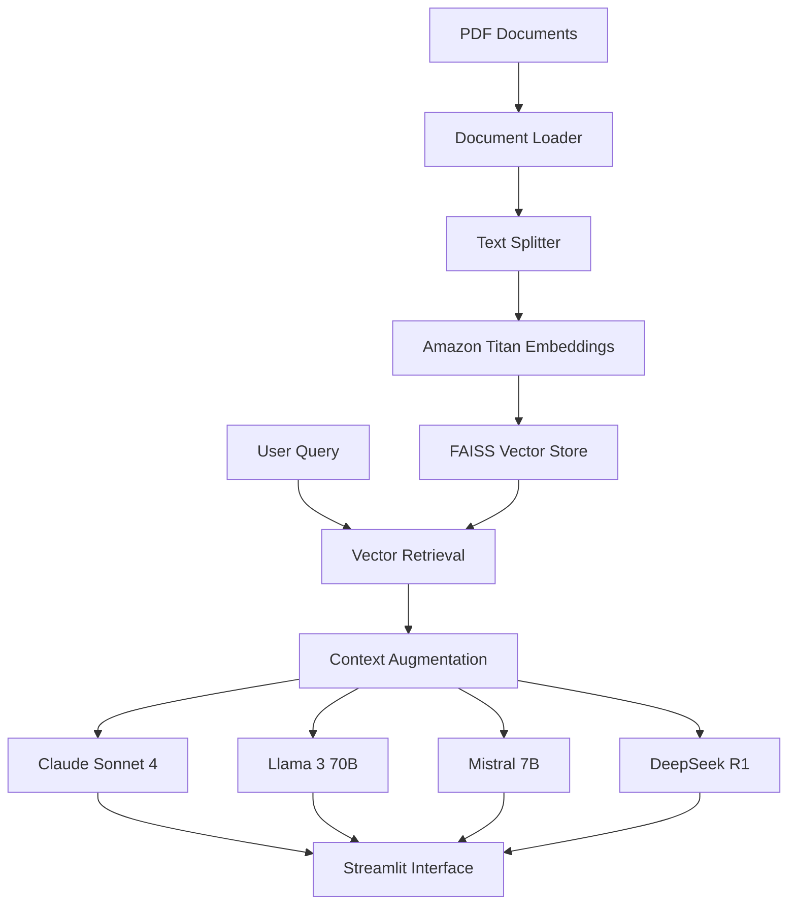

# 🚀 RAG PROJECT with AWS BEDROCK

<div align="center">


**Advanced Retrieval-Augmented Generation using Amazon Bedrock AI Services**

*Developed by Enes Aydin*

[🔗 Live Demo](#) | [📖 Documentation](#features) | [🚀 Quick Start](#installation)

</div>

---

## 📋 Table of Contents

- [Overview](#overview)
- [Features](#features)
- [Architecture](#architecture)
- [AI Models](#ai-models)
- [Prerequisites](#prerequisites)
- [Installation](#installation)
- [Configuration](#configuration)
- [Usage](#usage)
- [Project Structure](#project-structure)
- [API Reference](#api-reference)
- [Contributing](#contributing)
- [License](#license)

---

## 🎯 Overview

This project implements a sophisticated **Retrieval-Augmented Generation (RAG)** system powered by **Amazon Bedrock**, enabling users to query PDF documents using multiple state-of-the-art AI models. The system combines the power of semantic search with advanced language models to provide accurate, contextual responses based on your document corpus.

### 🌟 Why This Project?

- **Multi-Model Intelligence**: Compare responses from 4 different AI models
- **Enterprise-Grade Security**: Built on AWS Bedrock infrastructure
- **Scalable Architecture**: Cloud-native design for production workloads
- **Intuitive Interface**: Professional Streamlit web application
- **Real-time Processing**: Instant document analysis and query responses

---

## ✨ Features

### 🤖 **Multi-Model AI Support**
- **Claude Sonnet 4**: Anthropic's advanced reasoning model
- **Llama 3 70B**: Meta's powerful open-source model
- **Mistral 7B**: Efficient and fast processing
- **DeepSeek R1**: Advanced reasoning and complex problem solving

### 🔍 **Advanced Document Processing**
- **PDF Ingestion**: Automated PDF document loading and processing
- **Intelligent Chunking**: Recursive text splitting with optimal overlap
- **Vector Embeddings**: Amazon Titan embeddings for semantic search
- **FAISS Integration**: High-performance similarity search

### 🎨 **Professional Interface**
- **Responsive Design**: Modern, mobile-friendly UI
- **Real-time Feedback**: Loading states and progress indicators
- **Interactive Elements**: Hover effects and smooth animations
- **Professional Styling**: Custom CSS with gradient designs

### 🔒 **Enterprise Features**
- **AWS Integration**: Secure Bedrock client configuration
- **Scalable Storage**: FAISS vector store persistence
- **Error Handling**: Comprehensive exception management
- **Configuration Management**: Environment-based settings

---

## 🏗️ Architecture



### 🔄 **RAG Pipeline**

1. **Document Ingestion**: PDF files are loaded and processed
2. **Text Chunking**: Documents split into manageable chunks with overlap
3. **Embedding Generation**: Amazon Titan creates vector representations
4. **Vector Storage**: FAISS indexes embeddings for fast retrieval
5. **Query Processing**: User queries are embedded and matched
6. **Context Retrieval**: Most relevant chunks are retrieved
7. **Response Generation**: AI models generate contextual responses

---

## 🤖 AI Models

| Model | Provider | Strengths | Use Cases |
|-------|----------|-----------|-----------|
| **Claude Sonnet 4** | Anthropic | Advanced reasoning, nuanced understanding | Complex analysis, research |
| **Llama 3 70B** | Meta | Multilingual, robust performance | General queries, translation |
| **Mistral 7B** | Mistral AI | Speed, efficiency | Quick responses, summaries |
| **DeepSeek R1** | DeepSeek | Mathematical reasoning, logic | Technical problems, calculations |

---

## 📋 Prerequisites

### System Requirements
- **Python**: 3.8 or higher
- **AWS Account**: With Bedrock access enabled
- **Memory**: Minimum 8GB RAM recommended
- **Storage**: 2GB free space for vector indices

### AWS Permissions
```json
{
    "Version": "2012-10-17",
    "Statement": [
        {
            "Effect": "Allow",
            "Action": [
                "bedrock:InvokeModel",
                "bedrock:ListFoundationModels"
            ],
            "Resource": "*"
        }
    ]
}
```

---

## 🚀 Installation

### 1. Clone the Repository
```bash
git clone https://github.com/your-username/rag-bedrock-project.git
cd rag-bedrock-project
```

### 2. Create Virtual Environment
```bash
# Using venv
python -m venv venv
source venv/bin/activate  # Linux/Mac
# or
venv\Scripts\activate     # Windows

# Using conda
conda create -n rag-bedrock python=3.9
conda activate rag-bedrock
```

### 3. Install Dependencies
```bash
pip install -r requirements.txt
```

### 4. Create Requirements File
Create `requirements.txt` with the following dependencies:
```txt
streamlit>=1.28.0
langchain>=0.0.350
boto3>=1.34.0
faiss-cpu>=1.7.4
PyPDF2>=3.0.1
numpy>=1.24.0
python-dotenv>=1.0.0
```

---

## ⚙️ Configuration

### 1. AWS Credentials
Set up your AWS credentials using one of these methods:

**Option A: AWS CLI**
```bash
aws configure
```

**Option B: Environment Variables**
```bash
export AWS_ACCESS_KEY_ID=your_access_key
export AWS_SECRET_ACCESS_KEY=your_secret_key
export AWS_DEFAULT_REGION=us-east-1
```

**Option C: IAM Role** (Recommended for EC2/ECS)

### 2. Bedrock Model Access
Enable access to required models in AWS Bedrock console:
- `anthropic.claude-sonnet-4-20250514-v1:0`
- `meta.llama3-70b-instruct-v1:0`
- `mistral.mistral-7b-instruct-v0:2`
- `deepseek.r1-v1:0`
- `amazon.titan-embed-text-v1`

### 3. Directory Structure
```
project/
├── mainV1.py
├── requirements.txt
├── data/              # Place your PDF files here
├── faiss_index/       # Generated vector store (auto-created)
├── aws.jpeg           # AWS logo (optional)
├── bedrock.jpeg       # Bedrock logo (optional)
└── README.md
```

---

## 🎮 Usage

### 1. Prepare Documents
Place your PDF files in the `data/` directory:
```bash
mkdir data
cp your_documents/*.pdf data/
```

### 2. Start the Application
```bash
streamlit run mainV1.py
```

### 3. Process Documents
1. Open the application in your browser (typically `http://localhost:8501`)
2. Click **"🚀 Process Documents"** in the sidebar
3. Wait for document processing and vector index creation

### 4. Query Documents
1. Enter your question in the text input field
2. Click on any AI model button to get responses
3. Compare responses across different models

### 🎯 Example Queries
- "What are the main findings in the research paper?"
- "Summarize the key recommendations from the document"
- "What methodology was used in the study?"
- "Compare the results between different approaches"

---

## 📁 Project Structure

```
rag-bedrock-project/
│
├── 📄 mainV1.py                 # Main Streamlit application
├── 📄 requirements.txt          # Python dependencies
├── 📄 README.md                # Project documentation
├── 📄 .env.example             # Environment variables template
├── 📄 .gitignore               # Git ignore rules
│
├── 📁 data/                    # PDF documents directory
│   ├── document1.pdf
│   ├── document2.pdf
│   └── ...
│
├── 📁 faiss_index/             # Vector store (auto-generated)
│   ├── index.faiss
│   ├── index.pkl
│   └── ...
│
├── 📁 assets/                  # Static assets
│   ├── aws.jpeg
│   ├── bedrock.jpeg
│   └── ...
│
├── 📁 docs/                    # Additional documentation
│   ├── api_reference.md
│   ├── deployment_guide.md
│   └── troubleshooting.md
│
└── 📁 tests/                   # Unit tests
    ├── test_ingestion.py
    ├── test_retrieval.py
    └── test_models.py
```

---

## 🔧 API Reference

### Core Functions

#### `data_ingestion()`
Loads and processes PDF documents from the data directory.
```python
def data_ingestion():
    """
    Load PDF documents and split into chunks
    Returns: List of document chunks
    """
```

#### `get_vector_store(docs)`
Creates and saves FAISS vector store from document chunks.
```python
def get_vector_store(docs):
    """
    Create vector embeddings and FAISS index
    Args: docs - List of document chunks
    """
```

#### `get_response_llm(llm, vectorstore_faiss, query)`
Generates response using specified language model.
```python
def get_response_llm(llm, vectorstore_faiss, query):
    """
    Generate AI response for user query
    Args:
        llm - Language model instance
        vectorstore_faiss - FAISS vector store
        query - User question
    Returns: Generated response string
    """
```

### Model Functions

- `get_claude_llm()` - Initialize Claude Sonnet 4
- `get_llama3_llm()` - Initialize Llama 3 70B  
- `get_mistral_llm()` - Initialize Mistral 7B
- `get_deepseek_llm()` - Initialize DeepSeek R1

---

## 🚀 Deployment

### Local Development
```bash
streamlit run mainV1.py --server.port 8501
```

### Docker Deployment
```dockerfile
FROM python:3.9-slim

WORKDIR /app
COPY requirements.txt .
RUN pip install -r requirements.txt

COPY . .
EXPOSE 8501

CMD ["streamlit", "run", "mainV1.py", "--server.address", "0.0.0.0"]
```

### AWS ECS/Fargate
Deploy using AWS ECS with proper IAM roles for Bedrock access.

### Streamlit Cloud
1. Push to GitHub repository
2. Connect to Streamlit Cloud
3. Configure AWS credentials in secrets

---

## 🔍 Troubleshooting

### Common Issues

**Model Access Denied**
```
Error: AccessDeniedException
Solution: Enable model access in AWS Bedrock console
```

**FAISS Index Not Found**
```
Error: No such file or directory: 'faiss_index'
Solution: Process documents first using the sidebar button
```

**PDF Loading Failed**
```
Error: No PDF files found
Solution: Ensure PDFs are in the 'data/' directory
```

### Performance Optimization

1. **Chunk Size**: Adjust `chunk_size` parameter for your documents
2. **Overlap**: Modify `chunk_overlap` for better context retention
3. **Search Results**: Change `k` parameter in retrieval for more/fewer results
4. **Model Parameters**: Adjust `max_tokens` for longer/shorter responses

---

## 🤝 Contributing

We welcome contributions! Please see our contributing guidelines:

### Development Setup
```bash
git clone https://github.com/your-username/rag-bedrock-project.git
cd rag-bedrock-project
pip install -r requirements-dev.txt
pre-commit install
```

### Contribution Process
1. Fork the repository
2. Create a feature branch (`git checkout -b feature/amazing-feature`)
3. Commit your changes (`git commit -m 'Add amazing feature'`)
4. Push to the branch (`git push origin feature/amazing-feature`)
5. Open a Pull Request

### Code Standards
- Follow PEP 8 style guidelines
- Add docstrings to all functions
- Include unit tests for new features
- Update documentation as needed

---

## 📊 Performance Metrics

| Metric | Value | Description |
|--------|-------|-------------|
| **Query Response Time** | < 3 seconds | Average response time across models |
| **Document Processing** | ~50 pages/min | PDF processing speed |
| **Vector Search** | < 100ms | FAISS similarity search |
| **Concurrent Users** | 10+ | Supported simultaneous users |

---

## 🔐 Security Considerations

- **AWS IAM**: Use least-privilege access policies
- **Environment Variables**: Store sensitive data securely
- **Data Encryption**: Enable encryption in transit and at rest
- **Access Logging**: Monitor Bedrock API usage
- **Input Validation**: Sanitize user inputs

---

## 📈 Roadmap

### Phase 1 (Current)
- ✅ Multi-model RAG implementation
- ✅ PDF document processing
- ✅ FAISS vector search
- ✅ Streamlit web interface

### Phase 2 (Planned)
- 🔄 Multi-format document support (Word, TXT, etc.)
- 🔄 Advanced filtering and search
- 🔄 User authentication system
- 🔄 Document management interface

### Phase 3 (Future)
- 📋 API endpoint development
- 📋 Database integration
- 📋 Advanced analytics dashboard
- 📋 Multi-language support

---

## 📜 License

This project is licensed under the MIT License - see the [LICENSE](LICENSE) file for details.

```
MIT License

Copyright (c) 2024 Enes Aydin

Permission is hereby granted, free of charge, to any person obtaining a copy
of this software and associated documentation files (the "Software"), to deal
in the Software without restriction...
```

---

## 👨‍💻 Author

**Enes Aydin**
- 🌐 GitHub: [@your-username](https://github.com/your-username)
- 💼 LinkedIn: [your-linkedin](https://linkedin.com/in/your-profile)
- 📧 Email: your.email@example.com

---

## 🙏 Acknowledgments

- **Amazon Web Services** for Bedrock platform
- **Anthropic** for Claude models
- **Meta** for Llama models
- **LangChain** for RAG framework
- **Streamlit** for web interface
- **FAISS** for vector search capabilities

---

## 📞 Support

If you encounter any issues or have questions:

1. 📖 Check the [documentation](#table-of-contents)
2. 🔍 Search [existing issues](https://github.com/your-username/rag-bedrock-project/issues)
3. 🆕 Create a [new issue](https://github.com/your-username/rag-bedrock-project/issues/new)
4. 💬 Join our [discussions](https://github.com/your-username/rag-bedrock-project/discussions)

---

<div align="center">

**⭐ If this project helped you, please give it a star! ⭐**

Made with ❤️ by [Enes Aydin](https://github.com/your-username)

</div>
